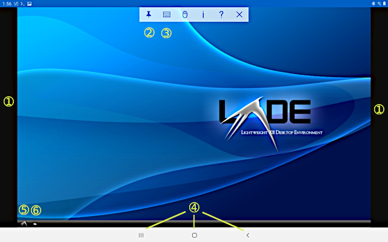

## How to INSTALL Alaterm


See file **DEVICES.md** for requirements.

### Preparation

1. While you are at the Alaterm repository web page,
look for the green **Code** button. Touch to open it,
then touch **Download ZIP**. It will download `alaterm-master.zip`
to wherever your browser puts downloads. If it is not the "Downloads"
folder, use Android file manager to move it there. But do not unzip it yet.

Note: Some browsers do not show the green **Code** button.
In that case, try a different browser.

2. Launch Termux. If you are new to Termux, you must first prepare it.
Issue these commands, one at a time. At the second command, Android may
show a popup messages, asking if you will allow Termux to access files.
Allow it:

```
pkg update
termux-setup-storage
```

Move the downloaded zip file into Termux home, and unzip it:

```
cd ~
mv ~/storage/downloads/alaterm-master.zip ~
unzip alaterm-master.zip
```

Navigate to the installer directory, and list its contents:

```
cd alaterm-master/v2installer && ls
```

You should see `alaterm-installer`, among other things.

3. Now to install:

```
bash alaterm-installer install
```

The script performs device checks, and may ask questions if unsure.
Android may show a popup about battery optimization.
If you allow it, then installation may run faster.

Completion takes about 30-60 minutes with a good Internet connection.
If your connection breaks during install,
or if you must turn off your device, no problem.
The script remembers where it was, and will resume from there
when you again launch the installer.


### Connecting to VNC Viewer

After a successful installation, you will see this message:

*To launch Alaterm, command:  alaterm*

Do it. You will see a message from Alaterm, then the command prompt
will change.

**Do not close Termux.**
Hold your device in landscape mode, like a laptop screen.
Open the **VNC Viewer** app.
At first use, you will see a short slide show.
When it finishes, you may dismiss the show by sweeping it from the edge.
VNC Viewer offers professional functions that you will not be using.

At lower right of VNC Viewer, touch the large (+) button.
A dialog box will appear.
You may name the connection anything you like (suggestion: Alaterm).
Its address is `127.0.0.1:5901` exactly.

You will then be asked for a password. It is **password** and should
be remembered. There is no advantage to a more secure password.
Do not request warning for insecure connection.

After that, a new black square will appear on the VNC Viewer screen.
Click it to open the LXDE Desktop. It will have a beautiful blue background
with the LXDE logo.
But if that is not what you see, then something went wrong.


### First view of the desktop

When the LXDE screen first appears, what you see may differ
from device to device. This is because Android may provide some features
that overlay LXDE. Here is a tour of what appears on my own device.
Some users may need to scroll the screen, to see it all.



(1) Black bands, usually at the sides, indicate that the LXDE deskttop
dimensions are different from your screen dimensions.
This often happens when the Android overlay is locked in place.
However, if you see black bands when the overlay is dismissed,
then you should change screen dimensions (see below).

(2) The top toolbar is part of the Android-VNC overlay.
If you do not need the overlay, click the thumbtack to dismiss it.
This is best when you use an external keyboard and mouse.
When the overlay is dismissed, the desktop may re-size to fill the screen.
You may temporarily restore the overlay by sweeping from top or bottom
of the screen.

(3) This icon enables/disables the on-screen keyboard.
Other icons in this set do various other things, which you may not need.

(4) The bottom Android-VNC overlay allows you to navigate to other
Android apps, or the Android desktop. This overlay is also managed
by the thumbtack, and by sweeping.

(5) The LXDE Menu works like the menu on a desktop computer.

(6) The file manager works like the file manager on a desktop computer.
Note that Android has many locations that you cannot access.


### Touchscreen vs. Keyboard and Mouse

You can use the touchscreen, keyboard and mouse, or all of them.
If you use a keyboard and mouse, it works like a desktop computer.
Left-click, right-click, wheel scroll, and double-click are honored.
Depending on your keyboard, some function keys may be honored, or not.

With touchscreen alone, usage is tricky. The cursor does not appear
where you touch. Wherever it is, it will follow your finger sweep, even if
your finger is not over the cursor. Then, when the cursor is positioned
to where you need it, tap anywhere on the screen.

Remember that the on-screen keyboard comes from the Android overlay.
If necessary, sweep from top or bottom of screen to see the overlay,
then tap on the keyboard icon.


### Screen dimensions

Alaterm is pre-configured for most devices in landscape orientation.
Note that the best screen resolution is not always the same as
your device screen resolution. For example, my 1920x1200 device
looks best at 1280x800 in Alaterm.

If you need to change the screen dimensions, there are two methods:

1. From the LXDE Menu: Preferences, Monitor Settings.

2. From the command-line (Alaterm running in Termux): `default-resolution`


### Exiting Alaterm

To exit Alaterm: `logout` returns you to Termux.

Then you may continue in Termux, or `exit` to leave.

The command-line terminal and VNC Viewer are independent Android apps.
Cosing the terminal does not automatically close the viewer.
Closing the viewer does not automatically close Alaterm.


### Installing more software.

Alaterm comes with a few built-in utility programs.
To install larger programs, such as GIMP or LibreOffice,
open the LXDE Menu, and click **HELP**.
It will tell you what you need to know.

All programs are installed or removed from the command-line window
(Alaterm running in Termux). There is no GUI for program management.

Particularly note that multimedia programs (audio-video)
are NOT supported. This is not a bug. Live with it.


### Where is Alaterm installed?

Termux home directory is Android `/data/data/com.termux/files/home`<br>
Termux software directory is `/data/data/com.termux/files/usr`<br>
Alaterm is in `/data/data/com.termux/alaterm`


